# KOLNY

**The colony trades while you sleep.**

KOLNY is an autonomous colony fund on Solana. Capital is deposited once into a
central vault, then spread across many independent AI agents called foragers,
each running its own strategy inside an isolated sub-account. The realized
performance of each forager becomes its pheromone score, and pheromone decides
how much capital flows down that trail in the next epoch. Good trails thicken
and attract more capital. Weak trails fade through time decay and drain. No
human picks the winning strategy.

This repository is the protocol specification: the architecture, the allocation
mathematics, the loss-containment model, the trust model, and the sources each
was checked against.

---

## How allocation works

The mechanism is an adaptation of the Ant System pheromone update
([Dorigo, Maniezzo and Colorni, 1996](https://jmvidal.cse.sc.edu/library/dorigo96a.pdf)),
with one change that matters: in ant colony optimization a deposit is never
negative, because a path cannot be worse than not walking it. In a fund it can.
A losing epoch actively erodes a trail rather than merely failing to reinforce
it.

```mermaid
%%{init: {'theme':'base','themeVariables':{'background':'#0E0F0C','mainBkg':'#5C4B3A','primaryColor':'#5C4B3A','primaryTextColor':'#E4E0D2','primaryBorderColor':'#B6E04A','secondaryColor':'#3E5A44','secondaryTextColor':'#E4E0D2','secondaryBorderColor':'#B6E04A','tertiaryColor':'#1A1712','tertiaryTextColor':'#E4E0D2','lineColor':'#B6E04A','textColor':'#E4E0D2','nodeTextColor':'#E4E0D2','clusterBkg':'#161310','clusterBorder':'#5C4B3A','edgeLabelBackground':'#0E0F0C','fontFamily':'monospace'}}}%%
flowchart LR
  DEP["Depositor"] -->|"deposit, mint shares"| BV["Brood Vault<br/>custody and shares"]
  BV -->|"routed by weight"| SUB["Forager sub-accounts<br/>isolated PDAs"]
  SUB --> RUN["Strategy execution<br/>inside position limits"]
  RUN -->|"closed and settled trades only"| PERF["Realized performance<br/>return minus drawdown penalty"]
  PERF -->|"bounded deposit"| PH["Pheromone<br/>evaporate, then deposit"]
  PH -->|"normalize, cap, drop"| W["Target weights"]
  W --> BV
  RUN -->|"limit breach or loss"| SL["Slash<br/>burn and cover"]
  SL --> RC["Risk Cache<br/>insurance reserve"]
  RC -->|"absorb shortfall"| BV

  classDef onchain fill:#5C4B3A,stroke:#B6E04A,stroke-width:1px,color:#E4E0D2;
  classDef signal fill:#3E5A44,stroke:#B6E04A,stroke-width:1px,color:#E4E0D2;
  classDef loss fill:#0E0F0C,stroke:#B4372E,stroke-width:1px,color:#E4E0D2;
  class BV,SUB,W onchain;
  class RUN,PERF,PH signal;
  class SL,RC loss;
```



Each epoch, every forager's trail evaporates and is then topped up by a bounded
function of what it actually earned:

```
tau_f(e+1)  =  max( 0 ,  (1 - rho) * tau_f(e)  +  D_f(e) )

D_f(e)      =  Q * tanh( perf_f(e) / s )
perf_f(e)   =  r_f(e)  -  lambda * DD_f(e)
```

`r_f` is the realized net return over the epoch, after fees, slippage and
funding. `DD_f` is the realized maximum drawdown inside that epoch, and
`lambda` prices it. `rho` is the evaporation rate; at the default `rho = 0.16`
on a weekly epoch, a trail that stops earning is half forgotten in about four
weeks and effectively gone in three months.

`tanh` is what keeps a single lucky epoch from taking over the colony: the
deposit is bounded to the open interval `(-Q, +Q)` no matter how large the
return, so influence accrues over many epochs or not at all.

Pheromone is then turned into capital:

```
1.  raw_f  = tau_f / sum_g tau_g            over Active foragers
2.  cap:     any w_f above w_max is clipped to w_max and the excess is
             redistributed among the un-capped foragers, repeated until
             no un-capped forager exceeds w_max
3.  drop:    any post-cap w_f below w_drop is set to 0; that forager is
             demoted to Scout and its capital returns to the vault
4.  final w_f are the target weights, summing to 1
```

`w_drop` is a demotion threshold, not a floor. A trail that fades is removed
from the main pool rather than propped up at a minimum weight.

A fixed `scout_budget` of deployable value, 10 percent by default, never enters
this competition. It funds small, fixed-size scout tickets for new and
probationary foragers, which is how a new agent gets a first allocation despite
starting at zero pheromone. Promotion requires a minimum number of epochs, a
minimum number of realized closed trades, and a performance bar.

Full derivation, the parameter table with on-chain field names and ranges, the
rejected alternatives, and a three-epoch worked example are in
[`docs/allocation-spec.md`](./docs/allocation-spec.md).

---

## Loss containment

Each forager trades from its own PDA sub-account and can withdraw only back to
the Brood Vault, never to an arbitrary address. Leverage is fixed at zero by
an on-chain parameter, assets are restricted to a whitelist with a liquidity
floor, and a single forager is capped at `w_max` of the main pool.

When a forager loses money, the loss is absorbed in this order:

```
1. the forager's own sub-account   (its allocated capital falls first)
2. the forager's bond              (slashed portion reimburses the vault)
3. the Risk Cache                  (covers residual up to the cache balance)
4. depositor net asset value       (any remainder is borne by depositors)
```

Steps 2 and 3 are the depositor cushion. Step 4 is where it ends. The cushion
is finite, and correlated losses across many foragers at once are the failure
mode that reaches step 4 fastest. The reserve ratio is published so the size of
the remaining cushion is always visible.

Bonds are posted in `$KOLNY` and carry a 30 percent haircut because the
collateral is volatile. The honest weakness, stated in the specification rather
than hidden: if the token falls hard, bonds are worth least at exactly the
moment they are needed most.

Details, slash triggers and the full parameter table are in
[`docs/risk-spec.md`](./docs/risk-spec.md).

---

## What this repository contains

```
programs/kolny-colony/
  src/lib.rs           program entrypoint and instruction surface
  src/state.rs         ColonyConfig, BroodVaultState, RiskCacheState, TrailBoard,
                       ForagerState
  src/math.rs          fixed-point evaporation, deposit transform, weight capping
  src/instructions/    admin, vault, forager, settlement, risk
  src/events.rs        26 events; src/errors.rs 33 error variants
  README.md            account table, PDA seeds, instruction reference
idl/
  kolny_colony.json    generated interface, 28 instructions
scripts/
  set-program-id.sh    placeholder-to-real program ID swap, wired into nothing
tests/
  kolny-colony.ts      integration tests, require a local validator
docs/
  architecture.md      system boundaries, components, epoch data flow
  allocation-spec.md   pheromone update, deposit transform, weights, parameters
  risk-spec.md         bonds, slashing, isolation, insurance cache, disclosure
  security.md          account validation, authority model, attack surface
  references.md        every external source, with verification dates
.github/
  workflows/ci.yml     the gate
  scripts/check.sh     the same gate, runnable locally
  scripts/gate.py      prohibited language, non-text characters, cross-references
```

The repository root is an Anchor workspace, so `anchor build` works on a clone
without further setup.

---

## Honesty

Autonomous agent trading loses money. A protocol that allocates capital to
agents inherits that fact, and KOLNY's credibility depends on saying so rather
than working around it.

Section 6 of [`docs/risk-spec.md`](./docs/risk-spec.md) is a prohibition list.
It names the specific phrases that may not appear on any KOLNY surface, and it
is deliberately the only place in the project where those phrases are written
down. The continuous-integration gate parses that section and fails the build if
any of those terms appears anywhere else in the tree, so the rule is enforced by
the repository rather than by good intentions.

What KOLNY publishes instead of safety claims:

- Realized performance only, in every headline figure. Never backtests, never
  marks on open positions, never projections.
- Current and maximum drawdown for every forager and for the colony, at the
  same size and in the same place as the returns.
- The full slash and burn history. A slashed forager stays in the list with its
  status, it is not deleted.
- Decayed trails, kept visible. A map showing only the routes that worked is a
  lie about the terrain.
- The insurance cache balance and reserve ratio, including when it is below
  target.
- Capital that could not be deployed, reported as an un-deployed reserve rather
  than quietly over-concentrated.

Allocation is not a forecast. It is a description of where value has already
been realized, decayed by how long ago it happened.

---

## Reading the specification

```bash
git clone https://github.com/kolny/kolny.git
cd kolny

# start here
less docs/architecture.md

# run the same gate CI runs
bash .github/scripts/check.sh
```

Suggested order: `docs/architecture.md` for the boundaries and the epoch loop,
then `docs/allocation-spec.md` for the mathematics, then `docs/risk-spec.md`
for what happens when it goes wrong, then `docs/security.md` for the trust
model, and `docs/references.md` when you want to check a claim against its
source.

---

## Contributing

Specification review is the most useful contribution while there is no deployed
program: an error in the allocation math or the loss waterfall is far cheaper to
fix here than after capital is at stake. See
[`CONTRIBUTING.md`](./CONTRIBUTING.md) for what to look for and the ground
rules.

---

## License

MIT. See [`LICENSE`](./LICENSE).
