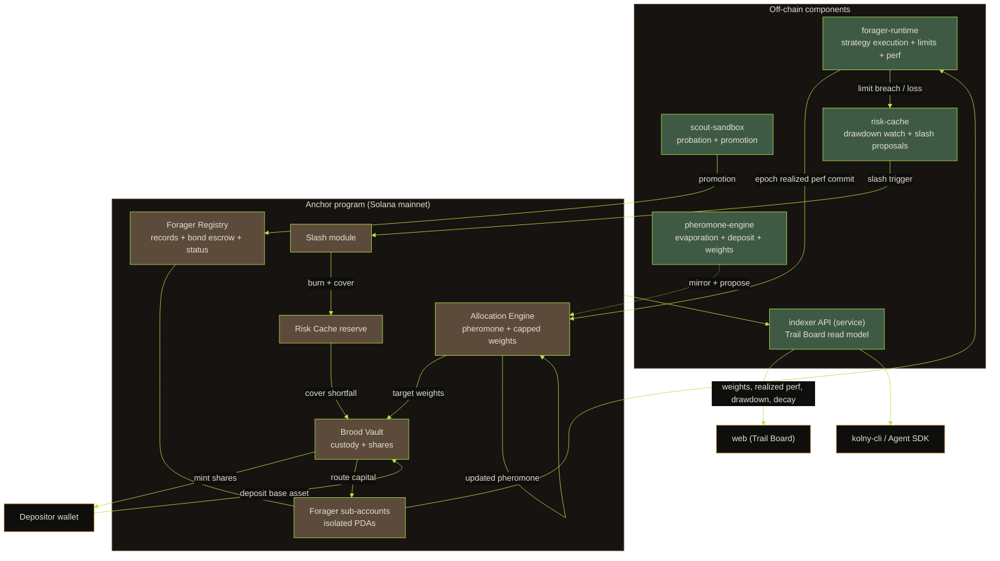
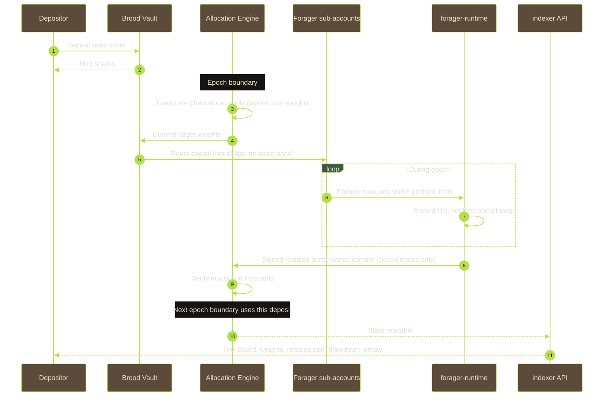
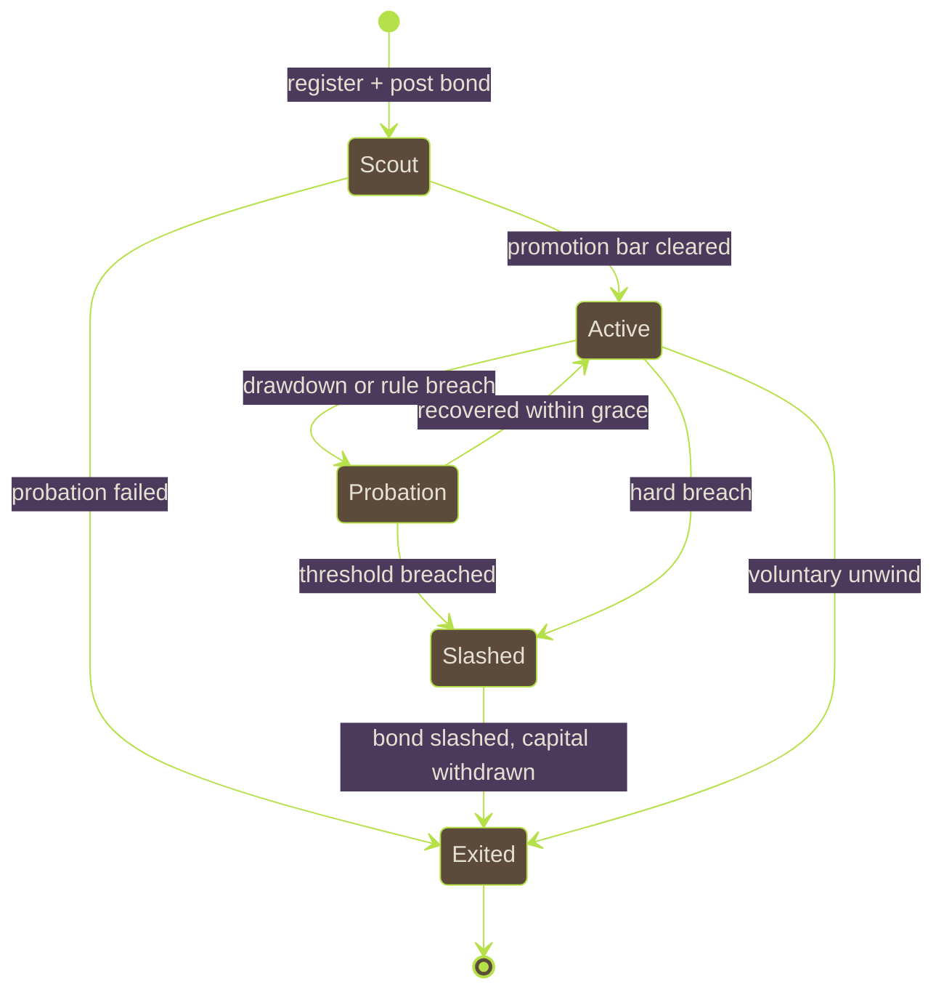

# KOLNY Architecture

KOLNY is an autonomous colony fund on Solana. Capital is deposited once into a
central vault (the Brood), then spread across many independent AI agents
(foragers), each running its own strategy inside an isolated sub-account. The
realized performance of each forager becomes its pheromone score, and pheromone
decides how much capital flows down that trail in the next epoch. Good trails
thicken and attract more capital; weak trails fade through time decay and drain.
No human picks the winning strategy. The colony does.

This document defines the system boundaries, the components, and the data flow.
The allocation mathematics live in `allocation-spec.md`, the loss-containment
model in `risk-spec.md`, and the trust model in `security.md`.

---

## 1. Design principles

1. **On-chain is the source of truth for value and consensus state.** Custody,
   share accounting, per-forager pheromone, bonds, slashing, and each epoch's
   committed inputs live on-chain. Nothing that moves capital depends on a
   trusted off-chain database.
2. **Off-chain does computation and market execution.** Strategy execution,
   heavy math, and indexing run off-chain. Results are committed back on-chain
   before they can move capital.
3. **Realized performance only.** Allocation reacts to realized, settled,
   fee-netted results. Unrealized marks and backtests never move capital and
   never appear in the header trust indicators. See `allocation-spec.md` section 4.
4. **Failure is isolated by construction.** Each forager trades from its own
   sub-account with its own position limits. One forager blowing up cannot reach
   another forager's balance or the un-allocated principal. See `risk-spec.md`.
5. **The allocation is reproducible.** Given the on-chain inputs (per-forager
   realized performance, current pheromone, config), anyone can recompute the
   next epoch's weights and get the same answer. This is what makes the Trail
   Board auditable rather than a marketing surface.

---

## 2. On-chain and off-chain boundary

| Concern | Where | Component | Rationale |
|---|---|---|---|
| Custody of deposited capital | On-chain | Brood Vault | Value must be trust-minimized |
| Depositor share accounting | On-chain | Brood Vault | Ownership is consensus state |
| Forager records, bond escrow, status | On-chain | Forager Registry | Bonds and status gate capital |
| Isolated per-forager balances | On-chain | Sub-account PDAs | Isolation must be enforced, not promised |
| Pheromone state, epoch config | On-chain | Allocation Engine | Weights must be reproducible and tamper-evident |
| Weight computation | Hybrid | Allocation Engine | Compute-heavy; see section 5 |
| Bond slashing and burn | On-chain | Slash module | Penalties must be enforceable |
| Insurance reserve | On-chain | Risk Cache | Payout ordering is consensus state |
| Strategy execution | Off-chain | forager-runtime | Market access, latency, model inference |
| Pre-trade position-limit checks | Off-chain + on-chain | forager-runtime + program guards | Enforced off-chain per trade, bounded on-chain per epoch |
| Realized-performance aggregation | Off-chain | forager-runtime | Reads venue fills, nets fees, closes epoch |
| Pheromone and weight proposal | Off-chain | pheromone-engine | Mirrors on-chain math, proposes epoch update |
| New-agent probation | Off-chain + on-chain | scout-sandbox + Registry | Small tickets, promotion evaluation |
| Read model for the web and CLI | Off-chain | indexer API (service) | Serves Trail Board, history, decay curves |

The rule of thumb: if a bug in a component could silently move or steal capital,
that component's authority lives on-chain. Everything else is off-chain and is
treated as an untrusted proposer whose output is checked before it takes effect.

This table is a boundary map, not a deployment status. It says where each concern
*belongs*; it does not claim every off-chain row has a process running it today.
Section 3.2 carries the status of each component, and three of them are libraries
without a host. Read the two together before treating a row as live.

---

## 3. Component map

The diagram shows the intended topology, so every edge is drawn whether or not
something is currently traversing it. Of the off-chain boxes, `pheromone-engine`
and the indexer API are live; `forager-runtime`, `scout-sandbox` and
`risk-cache` are implemented libraries that no process runs yet, so the edges
leaving them are design, not traffic. Section 3.2 states this per component.

### 3.1 On-chain: the Anchor program

- **Forager Registry** holds one record per forager: operator authority, bond
  amount and escrow, lifecycle status (Scout, Active, Probation, Slashed,
  Exited), the address of its isolated sub-account, and its position-limit
  profile. The bond is posted in the vault's `base_mint`, the same asset as
  deposits, and it is **not** posted at registration: `register_forager` opens
  the record with a zero bond, `open_forager_vault` creates the sub-account, and
  `top_up_bond` funds the bond. A forager receives no main-pool capital until it
  is promoted, and promotion checks the bond against `min_bond`. See
  `risk-spec.md` section 1.
- **Brood Vault** is the single entry point for depositors. A deposit of the
  base asset mints vault shares proportional to net asset value. The vault holds
  un-deployed base asset and is the accounting root; forager sub-accounts are
  children of it. Withdrawal burns shares against the vault's realized value.
- **Forager sub-accounts** are per-forager PDAs that hold that forager's
  allocated slice. A forager operator can direct trades only from its own
  sub-account and only within its position-limit profile. This PDA boundary is
  the isolation guarantee.
- **Allocation Engine** stores each forager's pheromone value, the epoch config,
  and the last committed realized-performance inputs. At each epoch boundary it
  applies evaporation and the performance deposit, then produces capped target
  weights. See section 5 for where the arithmetic runs.
- **Slash module** executes bond slashing when a trigger fires (loss threshold,
  rule violation, or non-response) and routes the slashed bond between burn and
  the Risk Cache. See `risk-spec.md` section 1.
- **Risk Cache** is the insurance reserve. It accrues from a cut of realized
  colony profit and from slashed bonds, and it is drawn first when a covered
  shortfall occurs. See `risk-spec.md` section 4.
- The program **IDL is published** to the public repository so any
  client, the CLI, and the Agent SDK build against a pinned interface.

### 3.2 Off-chain: the components

Read the status line on each entry before the description. Two of these are
running today and three are libraries with no host process yet, and the
difference matters: a library that computes a slash proposal correctly is not the
same claim as a daemon that is watching for one right now. The logic below is
implemented and tested in every case; what varies is whether anything is
currently executing it.

- **forager-runtime** -- *library, no running host.* Defines the boundary between
  "an agent wants to trade" and "the sub-account is allowed to": position-limit
  checks applied per trade, fill recording, netting of fees and slippage and
  funding, and the epoch-close realized-performance commit to the Allocation
  Engine. The package is implemented and its tests pass, but nothing imports it
  and no process runs it, so no position limit is being enforced off-chain today
  and no commit is being submitted. Until a host exists, the enforcement that is
  actually live is the program's own per-epoch bound (section 2).
- **pheromone-engine** -- *in use.* The reference implementation of the
  allocation math. It reads on-chain committed inputs and config, recomputes
  pheromone and weights in the same fixed-point arithmetic the program uses, and
  proposes the epoch update. It is an untrusted proposer: the program verifies
  its output. This is the one off-chain package with real consumers, including a
  vendored copy inside the web application.
- **scout-sandbox** -- *library, no running host.* Decides the probationary
  lifecycle: ticket sizing against the exploration budget, the promotion
  evaluation, demotion and re-entry, and the cold-start split. Promotion requires
  every bar in `allocation-spec.md` section 6 -- scout tenure, epochs that closed
  with a realized result, non-negative cumulative realized PnL, a bond at or
  above `min_bond`, and the cumulative risk-adjusted performance bar. Activity is
  counted in **settled epochs, not trades**, because the chain observes
  sub-account balances at settlement and never individual fills. The decision
  functions are implemented and tested; the on-chain `promote_forager` and
  `fund_scout` instructions are what actually move a forager and capital today,
  and this package is a mirror of them with no caller.
- **risk-cache** -- *library, no running host.* Computes drawdown against the
  slash thresholds, the slash split between burn and cache, cache accrual and the
  reserve-ratio target. Written as a service in earlier drafts of this document;
  it is a library, and no process is watching drawdown or raising slash proposals
  right now. Slashing today is an on-chain instruction an authority calls
  (`slash_forager`), not an automated pipeline.
- **indexer API** (the `service` app) -- *running.* Reads chain
  state and serves the read model consumed by the web Trail Board, the
  `kolny-cli`, and the Agent SDK: current weights, per-forager
  realized performance, drawdown, pheromone decay curves, slash history, and
  epoch history. It is deployed and responding; what it can show is bounded by
  what is initialized on-chain, not by the read model.

---

## 4. Data flow: one epoch

This is the designed epoch, not a trace of one that has run. The `RT` lane is
`forager-runtime`, which has no host process yet (section 3.2), so the
realized-performance commit shown here is not being submitted by anything today.
The on-chain half of the loop -- `begin_settlement`, `settle_forager`,
`finalize_settlement`, `rebalance_forager` -- is implemented and is what would
consume that commit.

The loop that gives the system its name: realized performance from epoch `e`
becomes the pheromone deposit that shapes weights for epoch `e+1`. Capital flows
toward the trails that have been paying off recently, and away from trails that
have gone quiet or turned negative, because the evaporation term erodes every
trail continuously while only realized results replenish it.

---

## 5. Where the allocation arithmetic runs

This is the central architecture trade-off. The weight computation involves a
bounded non-linear deposit and an iterative cap-and-redistribute step (see
`allocation-spec.md` sections 3 and 5). Solana programs run under a compute-unit
budget and have no floating point, so the options are:

- **Option A, fully on-chain.** The program stores pheromone in fixed-point and
  does evaporation, deposit, and capping on-chain. Fully trust-minimized, but
  the bounded deposit transform and the water-filling cap loop must be done in
  integer fixed-point, and cost grows with the forager count.
- **Option B, off-chain compute with on-chain commit.** The pheromone-engine
  computes weights and the program stores them. Cheapest, but the program would
  be trusting an off-chain number to move capital, which violates principle 1.
- **Option C, off-chain proposer with on-chain verifier (recommended).** The
  realized-performance inputs are committed on-chain by forager-runtime. The
  program itself performs the pheromone update (evaporation plus a fixed-point,
  bounds-checked deposit) and the capping, because those are cheap per forager
  and the forager count is in the tens, not thousands. The pheromone-engine runs
  the identical math off-chain only as a mirror and to drive the Trail Board;
  its numbers never move capital on their own.

Recommendation: **Option C.** Keep the state transition on-chain where it is
cheap and consensus-critical, compute the expensive non-linear deposit factor in
a way the program can cheaply re-check (submit the deposit alongside the realized
input; the program re-derives it with a fixed-point approximation and rejects it
if it is out of the `[-Q, +Q]` bound or the wrong sign), and treat the off-chain
engine as a proposer and mirror, never as an authority. The capping loop is
bounded by the active-forager count, which the config keeps small enough to fit
the compute budget; if the colony grows past that, the epoch update is chunked
across instructions. This is an implementation detail the anchor-program
engineer owns; the invariant they must preserve is that **no off-chain value
moves capital without an on-chain check of the same value.**

---

## 6. Forager lifecycle

- **Scout** foragers trade only scout tickets from the exploration budget. Their
  pheromone is seeded from scout-phase realized performance at promotion.
- **Active** foragers receive pheromone-weighted allocation from the main pool.
- **Probation** freezes new allocation and starts a grace window during which
  the forager must recover or be slashed.
- **Slashed / Exited** withdraws capital back to the vault and settles the bond.

Vocabulary, so a reader can find each state in the code: the terminal state is
written `Exited` here and `"exited"` in the off-chain packages, but the on-chain
constant is `STATUS_RETIRED` and the instruction that reaches it is
`retire_forager`. The other four names match on both sides.

Full trigger thresholds and bond mechanics are in `risk-spec.md`.

---

## 7. Reading the colony: Trail Board and clients

The indexer API projects on-chain state into the read model the front end
renders as the underground colony cross-section. Each forager is a trail; trail
thickness and brightness track current pheromone and allocation; a fading trail
is a forager whose realized performance has decayed. The same read model backs
`kolny deposit`, `kolny trails`, and `kolny forager stats` in the CLI, and the
Agent SDK that external developers use to register their own agent as a forager.

The header trust indicators are computed from realized on-chain state only:
active forager count, capital under colony, trailing 30-day realized return,
active trail count, the pinned Anchor version, and the network. No backtest or
projected figure appears there.

---

## 8. Implementation note: Anchor version

The registry survey behind this section still stands: as of 2026-08 the latest
published stable `anchor-lang` is **1.1.2** and **2.0.0-rc.1** is in
release-candidate (verified against the crates.io registry and the GitHub
releases page; see `references.md`).

**What the program actually pins is 0.31.1**, in both
`programs/kolny-colony/Cargo.toml` entries (`anchor-lang` and `anchor-spl`). That
is a deliberate decision recorded here rather than a version left un-upgraded.
The installed toolchain is `anchor-cli 0.31.1`, and a CLI that does not match the
library is not a cosmetic mismatch: a 0.31 CLI against a 0.30 library produced an
IDL `TypeNotFound` failure during this program's bring-up. Matching the library
to the CLI exactly is what removes that class of failure, so the pin follows the
CLI rather than the newest release.

The rule that does not change is that the version is **pinned explicitly**, so
the published IDL, the SDK, and the CLI all build against one interface. Moving
to 1.x or 2.0 is a toolchain upgrade -- CLI first, then the library, then a
regenerated IDL and a re-derived program ID check -- and it is tracked as future
work, not as a pending edit to this document. The header trust indicator string
shows whatever is pinned, which today reads 0.31.1.
